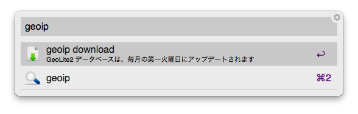
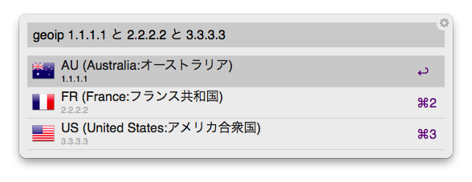

AlfredWorkflow GeoIP2 とは
=============================================================================

Alfred を使用して、IPアドレスのカントリコードを簡単に引くための workflow 。
選択したIPアドレスの whois 情報もプレビューできる。

## Install

1. workflow のインストール
    - [GeoIP2.alfredworkflow のダウンロード](https://github.com/harasou/alfred-workflows/blob/master/alfredworkflow/GeoIP2.alfredworkflow?raw=true)

1. MaxMind からデータベースのダウンロード
	 - Workflowsを開き、GeoIP2で、geoip(keyword)の /bin/bash(Run script)を開く。
	 - YOUR_LICENSE_KEY に自身のライセンスキーを入力する。 
	   ※(ライセンスキーはmaxmindにアカウントを発行後、取得する: https://dev.maxmind.com/geoip/geoip2/geolite2/)
    - Alfred で `geoip` と入力し、`geoip download` を選択＆決定するとダウンロードが開始され、ダウンロードが完了すると通知がくる。
    - 

## Usage

Alfred で `geoip ` と入力後、 IPアドレスを含むテキストを貼付けると、IPアドレスのカントリコードが表示される。

また、選択された IPアドレスに対し、以下のような操作が可能。

- `return` ：そのIPアドレスの whois 情報をプレビュー
- `⌘ + return` ：そのIPアドレスをクリップボードにコピー

## 補足

workflow にショートカット(例：⌘G など)を割り当てておくと、
「access_log などを適当に選択後、⌘G」と行った操作で、 カントリコードの一覧が表示されるので便利。

## License

- カントリコードのデータベースに MaxMind の GeoLite2 を利用しています。
> This product includes GeoLite2 data created by MaxMind, available from
<a href="http://www.maxmind.com">http://www.maxmind.com</a>.

